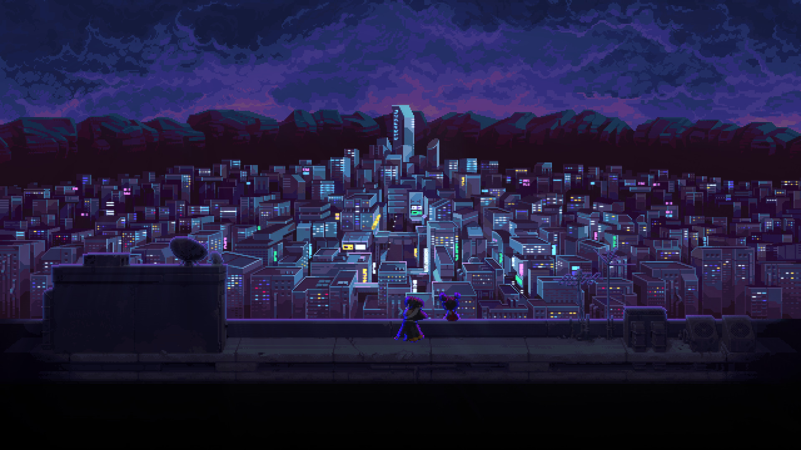
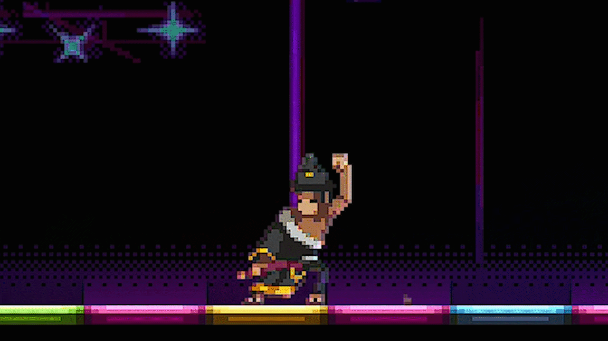

<!-- GENERAL GAME INFO -->
 

  <h2 align="center">KATANA ZERO</h2>

  

    SAMURAI IN NEON CITY
     
    <strong>Original game : </strong>
    <a href="https://en.wikipedia.org/wiki/Katana_Zero"><strong>General info »</strong></a>
    ·
    <a href="https://www.youtube.com/watch?v=1GkqYgIKh98"><strong>Youtube video »<strong></a>
     
     
  

<!-- TABLE OF CONTENTS -->

  
Table of Contents

  <ol>
    <li>
      <a href="#about-the-project">About The Project</a>
    </li>
    <li>
      <a href="#my-version">My version</a>
    </li>
    <li>
      <a href="#getting-started">Getting Started</a>
    </li>
    <li><a href="#how-to-play">How To Play</a></li>
    <li><a href="#class-structure">Class structure</a></li>
    <li><a href="#checklist">Checklist</a></li>
    <li><a href="#contact">Contact</a></li>
    <li><a href="#acknowledgments">Acknowledgments</a></li>
  </ol>

<!-- ABOUT THE PROJECT -->
## About The Project

Here's why:
 
* An absolute masterpiece of a game
* Technically challenging due to some complex mechanics
* Interesting to make

(<a href="#readme-top">back to top</a>)

## My version

This section gives a clear and detailed overview of which parts of the original game I planned to make.

### The minimum I will most certainly develop:
* Basic fighting mechanics(regular melee range katana attack) performed by your mouse
* Interection with environment items(flowerpot, bottles) that can be picked up and then thrown
* Time slow ability(no visuals)
* Ability to pet a cat
* HUD(and other signifiers for example time left to pass the level)
* Smooth movement that feels nice

### What I will probably make as well:
* Extended fighting mechanics(big range katana attack)
* Dust particles for running

### What I plan to create if I have enough time left:
* More advanced ai for enemies
* Time reverse animation at the end
* Visuals for time slow mechanic

(<a href="#readme-top">back to top</a>)

<!-- GETTING STARTED -->
## Getting Started
Detailed instructions on how to run your game project are in this section.

### Prerequisites

This is an example of how to list things you need to use the software and how to install them.
* Visual Studio 2022

### How to run the project

Explain which project (version) must be run.
* any extra steps if required 

(<a href="#readme-top">back to top</a>)

<!-- HOW TO PLAY -->
## How to play 

### Controls
* Movement is performed with w a s d keys: a and d keys move you to the sides, w key corresponds to jumping, s key makes you crouch
* a + s or d + s - you roll in either right or left direction
* To interact with environment objects(like flower pots or lamps or if you want to pet a cat) you need to press space
* When throwable object is picked, next attack(left click) will throw it
* In order to slow the time you need to press left shift

(<a href="#readme-top">back to top</a>)

<!-- CLASS STRUCTURE -->
## Class structure 

### Object composition 
I applied object composition(aggregation) for Entity, Enemy(and enemyType child classes), Player, child classes of interactable objects, screenoverlay, particle implementation, hud and other classes which needed some textures, they contain sprite pointer which is used for drawing specific animations, but they don't own this sprite(all sprites are managed by sprite manager). Sprite contains pointer to Texture class which is kind of object composition but not every sprite owns its texture. 
Player constains interactableObject and throwable object pointers in order to handle specific interactions with objects.
My enemy class constains a pointer to base class entity which is used for movement to target like player.
In order to achieve handling particles in replay, i contain pointer to ReplayParticleEvent inside particle classes which is linked to particle when particle is created during gameplay, when particle is deactivated i change value of lifetime inside that specific ReplayParticleEvent to specific m_TimeAlive of that particle.

I use association inside:
LevelManager <-> particleManager
LevelManager <-> SoundManager

### Inheritance 
I applied inheritance for entity -> player and entity -> enemy -> enemyType structures.
I use entity as general interface for checking collisions and basic physics stuff. Enemy base class contains general implementation for ai, which is then modified in specific enemyType classes.
Also i applied inheritance for interactable object class, which constains basic interface for player interactions with certain type of objects(door, cat, throwable object)

### ..

(<a href="#readme-top">back to top</a>)

<!-- CHECKLIST -->
## Checklist

- [x] Accept / set up github project
- [x] week 01 topics applied
    - [x] const keyword applied proactively (variables, functions,..)
    - [x] static keyword applied proactively (class variables, static functions,..)
    - [x] object composition (optional)
- [x] week 02 topics applied
- [x] week 03 topics applied
- [x] week 04 topics applied
- [x] week 05 topics applied
- [x] week 06 topics applied
- [x] week 07 topics applied
- [x] week 08 topics applied
- [x] week 09 topics applied (optional)
- [x] week 10 topics applied (optional)

(<a href="#readme-top">back to top</a>)

<!-- CONTACT -->
## Contact

Oleh Tykhyi - oleh.tykhyi@student.howest.be

Project Link: [https://github.com/HowestDAE/gd14-olehtykhyi#](https://github.com/your_username/repo_name)

(<a href="#readme-top">back to top</a>)

<!-- ACKNOWLEDGMENTS -->
## Acknowledgments

* https://github.com/nlohmann/json
* https://json.nlohmann.me/api/basic_json/
* https://github.com/Marcel-Rei/Prog-2-Unity-JSON-Exporter
* https://en.cppreference.com/

(<a href="#readme-top">back to top</a>)

