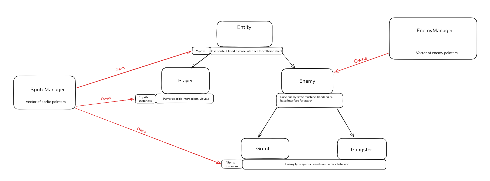
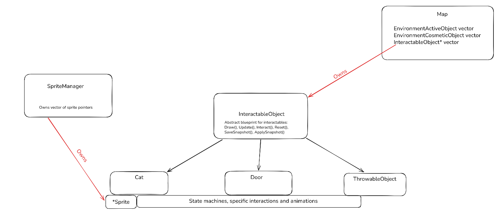

<!-- GENERAL GAME INFO -->
 

  <h2 align="center">KATANA ZERO</h2>

  

    SAMURAI IN NEON CITY
     
    <strong>Original game : </strong>
    <a href="https://en.wikipedia.org/wiki/Katana_Zero"><strong>General info »</strong></a>
    ·
    <a href="https://www.youtube.com/watch?v=1GkqYgIKh98"><strong>Youtube video »<strong></a>
     
     
  

<!-- TABLE OF CONTENTS -->

  
Table of Contents

  <ol>
    <li>
      <a href="#about-the-project">About The Project</a>
    </li>
    <li>
      <a href="#my-version">My version</a>
    </li>
    <li>
      <a href="#getting-started">Getting Started</a>
    </li>
    <li><a href="#how-to-play">How To Play</a></li>
    <li><a href="#class-structure">Class structure</a></li>
    <li><a href="#checklist">Checklist</a></li>
    <li><a href="#contact">Contact</a></li>
    <li><a href="#acknowledgments">Acknowledgments</a></li>
  </ol>

<!-- ABOUT THE PROJECT -->
## About The Project

Here's why:
 
* An absolute masterpiece of a game
* Technically challenging due to some complex mechanics
* Interesting to make

(<a href="#readme-top">back to top</a>)

## My version

This section gives a clear and detailed overview of which parts of the original game I planned to make.

### The minimum I will most certainly develop:
* Basic fighting mechanics(regular melee range katana attack) performed by your mouse
* Interection with environment items(flowerpot, bottles) that can be picked up and then thrown
* Time slow ability(no visuals)
* Ability to pet a cat
* HUD(and other signifiers for example time left to pass the level)
* Smooth movement that feels nice

### What I will probably make as well:
* Extended fighting mechanics(big range katana attack)
* Dust particles for running

### What I plan to create if I have enough time left:
* More advanced ai for enemies
* Time reverse animation at the end
* Visuals for time slow mechanic

(<a href="#readme-top">back to top</a>)

<!-- GETTING STARTED -->
## Getting Started
Detailed instructions on how to run your game project are in this section.

### Prerequisites

This is an example of how to list things you need to use the software and how to install them.
* Visual Studio 2022

### How to run the project

Explain which project (version) must be run.
* any extra steps if required 

(<a href="#readme-top">back to top</a>)

<!-- HOW TO PLAY -->
## How to play 

### Controls
* Movement is performed with w a s d keys: a and d keys move you to the sides, w key corresponds to jumping, s key makes you crouch
* a + s or d + s - you roll in either right or left direction
* To interact with environment objects(like flower pots or lamps or if you want to pet a cat) you need to press space
* When throwable object is picked, next attack(left click) will throw it
* In order to slow the time you need to press left shift

(<a href="#readme-top">back to top</a>)

<!-- CLASS STRUCTURE -->
## Class structure 

## Object composition 
Object composition is applied within ScreenOverlay class, which manages my Hud output and lifetime. \
Most of my manager classes uses object composition owning a vector of specific type. 
 * ParticleManager owns two pool vectors for AttackParticle pointers and CosmeticParticle pointers.
 * EnemyManager owns vector of Enemy pointers.
 * SoundManager owns vector of SoundEffect pointers and SoundStream pointers
 * SpriteManager owns vector of Sprite pointers.

Also Map class owns three vectors of environment objects: EnvironmentActiveObject, EnvironmentCosmetiObject and InteractableObject. EnvironmentActiveObject instances and EnvironmentCosmeticObject instances are stored by value thus they are deleted automatically. But my InteractableObjects are stored via pointers because i use it to implement polymorphic behavior for player interactions with those objects.

## Object aggregation
To enforce memory safety and perform easy management of animations and visuals, classes like 'Entity', 'Player', 'ScreenOverlay', 'EnvironmentActiveObject', 'EnvironmentCosmeticObject' and various 'InteractableObject' subclasses use aggregation. \ 
They maintain pointer to 'Sprite' instances, allowing them to cycle through animations and draw themselves without owning the underlying asset lifetimes. All sprite allocations, updates and destructions are entirely controlled by 'SpriteManager'.

## Object association
I use association inside 'LevelManager', 'ParticleManager' and 'SoundManager'.
Those classes need to access data of each other to output correct data or store correct data for my replay mechanic.
So i maintain these relations:
* LevelManager <-> ParticleManager
* LevelManager <-> SoundManager

## Inheritance 
I have two inheritance trees:
* Entities: I have two main branches for that, which are 'Entity -> Player' and 'Entity -> Enemy -> EnemySubClass'. The base entity class functions are used as general interface for physics and collisions. The enemy base class includes generalized state machine and base AI for enemy instances(regular bfs pathfinding). To handle tracking mechanics, enemy base class maintains 'Entity' pointer to its current movement target(such as the 'Player'), so here it can also be easily used to track other entities than player. Specialized attack behaviors are then isolated inside subclasses of enemy type(Grunt class and Gangster class).
  
* Interactable objects: InteractableObject class is abstract interface layout. This base class sets up basic possible interactions which then are extended inside child subclasses. In these child subclasses i handle specific animations, collisions and states for each subclass.
  

(<a href="#readme-top">back to top</a>)

<!-- CHECKLIST -->
## Checklist

- [x] Accept / set up github project
- [x] week 01 topics applied
    - [x] const keyword applied proactively (variables, functions,..)
    - [x] static keyword applied proactively (class variables, static functions,..)
    - [x] object composition (optional)
- [x] week 02 topics applied
- [x] week 03 topics applied
- [x] week 04 topics applied
- [x] week 05 topics applied
- [x] week 06 topics applied
- [x] week 07 topics applied
- [x] week 08 topics applied
- [x] week 09 topics applied (optional)
- [x] week 10 topics applied (optional)

(<a href="#readme-top">back to top</a>)

<!-- CONTACT -->
## Contact

Oleh Tykhyi - oleh.tykhyi@student.howest.be

Project Link: [https://github.com/HowestDAE/gd14-olehtykhyi#](https://github.com/your_username/repo_name)

(<a href="#readme-top">back to top</a>)

<!-- ACKNOWLEDGMENTS -->
## Acknowledgments

* https://github.com/nlohmann/json
* https://json.nlohmann.me/api/basic_json/
* https://github.com/Marcel-Rei/Prog-2-Unity-JSON-Exporter
* https://en.cppreference.com/
* https://github.com/UnderminersTeam/UndertaleModTool.git

(<a href="#readme-top">back to top</a>)

